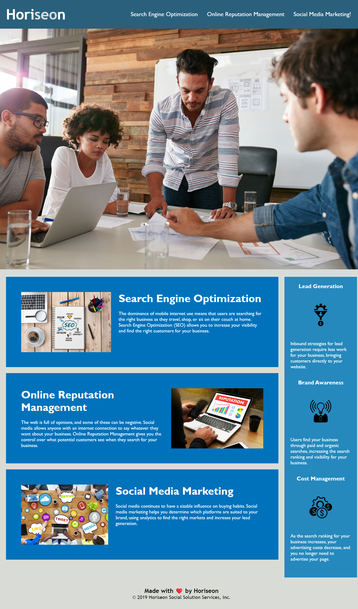

# Horiseon Social Solutions Service

Webpage for [Horiseon Social Solutions Services](https://amikerb.github.io/Horiseon/) showcasing their services. Webpage was already set up with starter cod. Code was modified and additional code added to make the webpage more accessibile as well as bug fixes and code organisation.

## Usage

Webpage features navigation bar along the header with clickable links taking the user to the coresponding paragraph which explains the service in depth.

### Screenshot of Webpage

## Credits 

[Starter code](https://github.com/skills-bootcamp/frontend-dev/tree/main/week1/day4/challenge) was provided.

### Resouces
- [Semantic HTML](https://www.w3schools.com/html/html5_semantic_elements.asp)
- [Image `alt` attributes](https://www.w3schools.com/tags/att_img_alt.asp)
- [Organizing your CSS](https://developer.mozilla.org/en-US/docs/Learn/CSS/Building_blocks/Organizing)