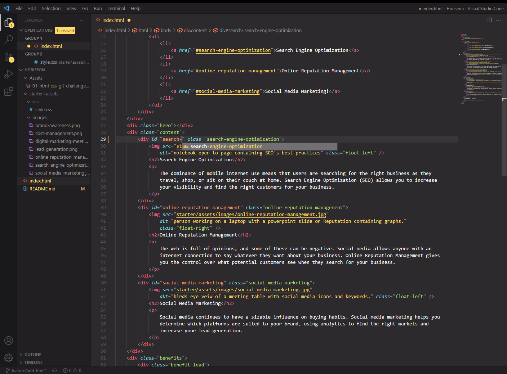

# Horiseon Social Solutions Service

Webpage for [Horiseon Social Solutions Services](https://amikerb.github.io/Horiseon/) showcasing their services. Webpage was already set up, code modified and additional code added to make the webpage more accessibile as well as bug fixes and organised.

## Installation

N/A

## Usage

Webpage features navigation bar along the header with clickable links taking the user to the coresponding paragraph which explains the service in depth. Webpage has alt attributes to make it more accessible as well as added comments to the CSS file.

### Visual Studio Code

## Credits 

[Starter code](https://github.com/skills-bootcamp/frontend-dev/tree/main/week1/day4/challenge) was provided.

### Starter Webpage

### Resouces
- [Semantic HTML](https://www.w3schools.com/html/html5_semantic_elements.asp)
- [Image `alt` attributes](https://www.w3schools.com/tags/att_img_alt.asp)

## License 

License under MIT license 